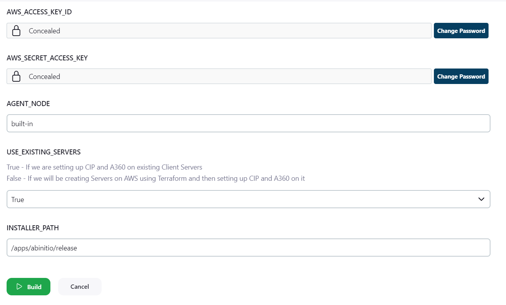

Step 1: Jenkins Parameters Required

    1. AGENT_NODE - Jenkins Agent Node to run the script on

    2. USE_EXISTING_SERVERS - True / False
        
        True - If we are setting up CIP and A360 on existing Client Servers
        False - If we will be creating Servers on AWS using Terraform and then setting up CIP and A360 on it

    3. INSTALLER_PATH - Path where all the CIP related installers are kept

    IF YOU ARE USING AWS JENKINS YOU WILL NEED FOLLOWING PARAMETERS
        - AWS_ACCESS_KEY_ID
        - AWS_SECRET_ACCESS_KEY

